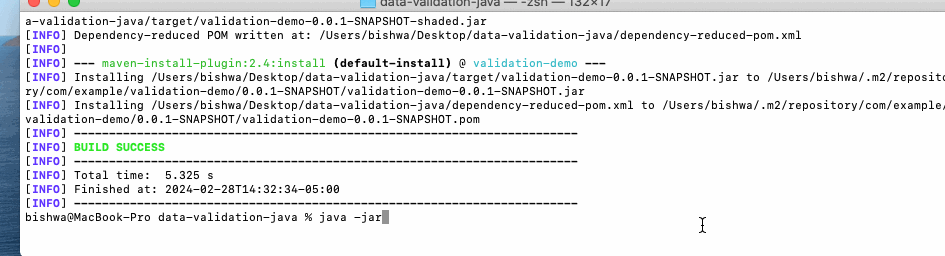

# Java Data Processing and Validation Demo
**quick look**:

This project showcases a Java application that handles JSON data, performs input validation, and utilizes logging for improved error tracking and debugging.

## Introduction

In today's software landscape, dealing with JSON data is a common task, whether it's received from APIs, stored in files, or generated by other systems. This project aims to demonstrate a robust approach to processing JSON data in a Java environment, including:

- Parsing JSON data using the Jackson library.
- Validating input data to ensure it meets specific criteria.
- Logging events and errors to facilitate debugging and decision-making.

## Features

- **JSON Processing**: The application utilizes Jackson, a widely-used library for JSON data-binding in Java, to parse JSON data into Java objects seamlessly.

- **Input Validation**: Custom input validation mechanisms ensure that incoming data meets specified criteria, enhancing data integrity and security.

- **Exception Handling**: Robust exception handling, including custom validation exceptions, ensures graceful error management and user-friendly error messages.

- **Logging**: Utilizes Log4j for logging application events, allowing developers to track application behavior and diagnose issues effectively.

- **Unit Testing**: The project includes comprehensive unit tests using JUnit to validate the input validation logic, ensuring reliability and stability.

## Project Structure

- `src/main/java`: Contains the main Java source files for the application.
- `src/test/java`: Houses the unit tests for testing various components of the application.

## Setup and Usage
**Prerequisites:** Make sure Java, Maven are installed

1. Clone the repository to your local machine. `git clone https://github.com/bishwaproject/data-validation-java.git`
2. `cd data-validation-java`
3. Build the project using Maven: `mvn clean install`.
4. Run the application:For example: `java -jar target/validation-demo-0.0.1-SNAPSHOT.jar`.

*You can modify the `user-data.json` file to include the desired user information.
And run the application to validate and process the JSON data.*

## Dependencies

- **Jackson**: A high-performance JSON processor for Java, providing easy-to-use JSON parsing and generation capabilities.
- **Log4j**: A reliable logging framework for Java, offering configurable logging levels and flexible output options.
- **JUnit**: A popular unit testing framework for Java, facilitating the creation and execution of automated tests to ensure code quality.

## Contribution

Contributions to the project are welcome! Feel free to connetct :)

